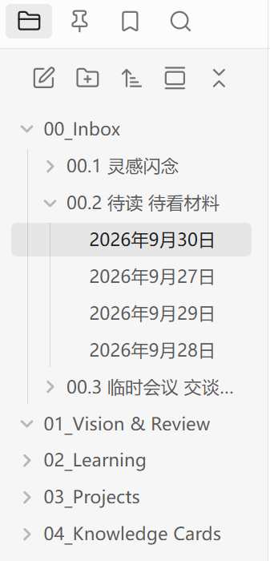

# Folder Pin View

固定常用文件夹，快速切换父目录与子目录，专注当前内容。

Pin your folders, switch between parent folders and subfolders, and focus on what matters.

**版本 / Version:** 2.2.6 · **Obsidian:** 1.13.0+ · **许可 / License:** MIT

## 实际效果 / Screenshots

| 原生文件列表 / Native explorer | 文件夹置顶视图 / Folder Pin View |
| --- | --- |
|  |  |

## 功能 / Features

| 中文 | English |
| --- | --- |
| **两层快捷栏**：固定父目录，快速切换直接子目录；两排均可拖动排序。 | **Folder tabs:** Pin parents, switch to direct subfolders, and drag either row to reorder. |
| **目录内搜索**：搜索当前目录及下级目录的内容，沿用原生搜索语法。 | **Folder search:** Search content in the current folder and its descendants using native syntax. |
| **原生打开与拖放**：Ctrl/Cmd 或中键打开新标签页；拖到编辑器生成链接，拖到白板添加卡片。 | **Native opening & dragging:** Ctrl/Cmd-click or middle-click opens new tabs. Drop into an editor for links or a canvas for cards. |
| **文件管理**：新建、重命名、删除、批量移动；右键接入白板、数据库等原生菜单。 | **File management:** Create, rename, delete and move items in batches, with native Canvas and Bases menus. |
| **多选与导航**：独立多选模式、Shift 连选、键盘导航、六种排序、可选自动定位。 | **Selection & navigation:** Selection mode, Shift ranges, keyboard navigation, six sort modes and optional auto-reveal. |
| **自适应界面**：窄侧栏工具栏保持单行；中英双语、主题适配、目录状态记忆。 | **Adaptive interface:** Single-row toolbar in narrow sidebars, Chinese/English, theme support and per-folder state. |

## 安装与更新 / Install & Update

从 [Releases](https://github.com/cimuyang/folder-pin-view/releases) 下载并解压安装包，将 `main.js`、`manifest.json`、`styles.css` 放入笔记库的 `.obsidian/plugins/folder-pin-view/`，然后启用插件。

Download and extract the package from [Releases](https://github.com/cimuyang/folder-pin-view/releases). Copy `main.js`, `manifest.json` and `styles.css` into your vault's `.obsidian/plugins/folder-pin-view/`, then enable the plugin.

更新时先停用插件，替换上述三个文件，**保留 `data.json`**，再启用。

To update, disable the plugin, replace the three files, **keep `data.json`**, then enable it again.

## 使用 / Usage

1. 在原生文件列表中右键文件夹，选择“固定文件夹”。第一排浏览父目录，第二排切换子目录；第二排可在设置中关闭。  
   Right-click a folder in the native explorer and choose **Pin folder**. Use the first row for parents and the second for subfolders; the second row is optional.
2. 右键进入“多选模式”，点击选择项目；右键可批量打开、移动或删除。按 Esc 或点击“完成”退出；Shift 可连选。  
   Enter **Select multiple items** from the context menu. Click to select, then right-click to open, move or delete the selection. Exit with Escape or **Done**; Shift selects a range.
3. 点击工具栏第六个搜索按钮，在括号内输入关键词。范围为点击时选定的目录及下级目录；删除查询中的目录条件会恢复全库搜索。  
   Click the sixth toolbar button and type inside the parentheses. Search covers the folder selected when clicked and its descendants; removing the path condition searches the whole vault.
4. 拖到文件夹或标签可移动文件；拖到编辑器或白板可创建链接或卡片，保留源文件。  
   Drop onto a folder or tab to move files. Drop into an editor or canvas to create links or cards while keeping the source files.

目录搜索需要启用“搜索”核心插件；白板、数据库菜单随对应核心插件的启用状态变化。

Folder search requires the Search core plugin. Canvas and Bases menu items depend on their core plugins being enabled.

**快捷键 / Shortcuts:** ↑↓ 导航 / Navigate · Enter 打开 / Open · F2 重命名 / Rename · Ctrl/Cmd+点击 / Click 新标签页 / New tab · Shift 连选 / Range · Esc 退出多选 / Exit selection · 多选模式下 / In selection mode: Ctrl/Cmd+A 全选可见项目 / Select visible items

## 2.2.6 更新 / What's New in 2.2.6

- **新标签页打开**：Ctrl/Cmd 点击与中键点击沿用原生习惯。  
  **New tabs:** Ctrl/Cmd-click and middle-click follow native opening behavior.
- **独立多选模式**：显示已选数量，支持批量打开、移动和删除。  
  **Selection mode:** Selection count plus batch opening, moving and deletion.
- **原生右键菜单**：空白处和文件夹支持新建白板、数据库及菜单扩展。  
  **Native context menus:** Blank areas and folders support Canvas, Bases and menu integrations.
- **编辑器与白板拖放**：支持单文件、多文件拖放，保留原有拖动移动。  
  **Editor & canvas drops:** Drag single or multiple files, alongside existing drag-to-move.
- **当前目录内容搜索**：新增第六个按钮，打开带目录条件的原生搜索。  
  **Folder content search:** A sixth button opens native Search with a folder filter.
- **窄侧栏适配**：自动收紧间距与按钮，六个操作保持单行。  
  **Narrow sidebar support:** Spacing and buttons adapt to keep all six actions on one row.

## 开发 / Development

Node.js 24:

```sh
npm ci
npm run typecheck
npm test
npm run build
```

`npm run dev` 监听源码变化。发布文件为 `main.js`、`manifest.json`、`styles.css`。  
`npm run dev` watches source changes. Release files are `main.js`, `manifest.json` and `styles.css`.

## 隐私与许可 / Privacy & License

插件不发送网络请求，不收集遥测数据；设置仅保存在笔记库的插件目录 `data.json` 中。[MIT License](LICENSE)。

The plugin makes no network requests and collects no telemetry. Settings stay in `data.json` in the vault's plugin directory. [MIT License](LICENSE).
